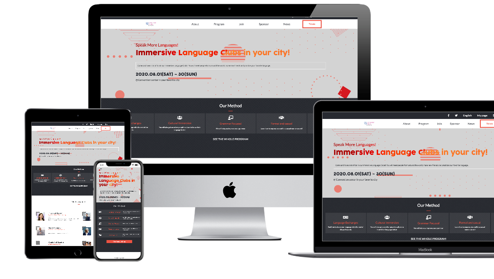

# HTML-Capstone-Project
Capstone project for HTML curriculum

Clone of Cindy Shin in Behance's design template for Web Page - A Microverse Solo Project made By José Francisco Silva Díaz

This website supports two resolutions: 
- mobile: up to 768px
- desktop: from 768px

And there are 3 HTML files to explore:
- Homepage
- About (click on any link that mentions the word about. Or click in the links down below)
- Tickets (To access, click on any link that says the word tickets, or the buttons that says join us. Or click in the links down below)

## Built With

- HTML
- CSS
- Bootstrap

## Live Demo

- [Live Demo Link](https://raw.githack.com/SunnySparks/HTML-Capstone-Project/work-branch/index.html)
- [About webpage](https://raw.githack.com/SunnySparks/HTML-Capstone-Project/work-branch/about.html)
- [Tickets webpage](https://raw.githack.com/SunnySparks/HTML-Capstone-Project/feature-branch/tickets.html)

## Website video demonstration

- In order to see a more detailed explanation[Check this video](https://www.loom.com/share/5f188709fefd42b4b381ad9c3f0bfe7f)
## Getting Started

**Original Design**
- Go to [Cindy Shin design idea on Behance.net](https://www.behance.net/gallery/29845175/CC-Global-Summit-2015) and take a look at it. The main purpose of this website is to replicate the looks of her design, while changing the containers to make it look personalized

In order to get a local copy you just need the following elements 

### Prerequisites

- Browser
- Internet

- Download the code from repository (https://github.com/SunnySparks/HTML-Capstone-Project/tree/work-branch) and double click the index.html file

## Author

👤 **José Francisco Silva Díaz** AKA **Sunny Díaz**

- Github: [@SunnySparks](https://github.com/sunnySparks)
- Twitter: [@JosFranT6](https://twitter.com/josfrant6)
- Linkedin: [linkedin](https://www.linkedin.com/in/josé-francisco-silva-díaz-a2a9421a6)

## Show your support

Give a ⭐️ if you like this project! and feel free to leave any feedback. This will help me to improve as a web developer.

## Acknowledgments

In this project I learned so much about bakground and positioning, I was able to add a background to a text, also I learned how to make collapsable hamburger menus, to give a color shade to background images, to make a container box with transparency, and the biggest acknowledgement for me was to make a border based on an image (as seen on the tickets website). The majority of the website is about transparencies . 

## Credits

All the design layout, color and font suggestions belong to [Cindy Shin](https://www.behance.net/adagio07) please check out her work. 

The purpose of this website is for HTML & CSS demonstration only, all the design ideas belong to the original autor. This project was NOT made for commercial purposes.
